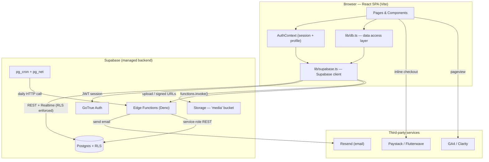
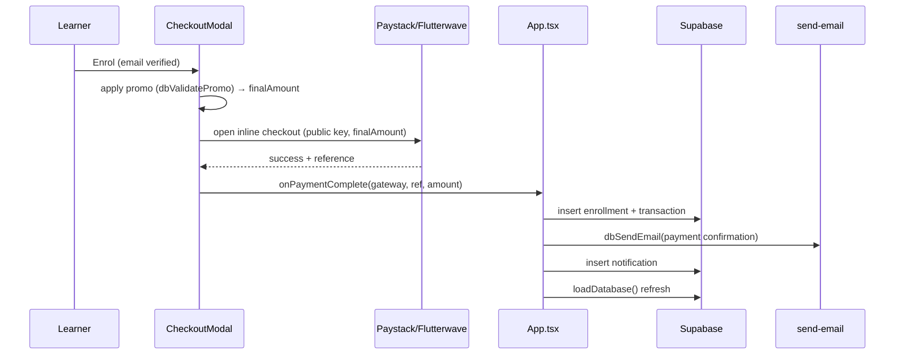

# LANI Academy — Architecture & Technical Documentation

Version 1.0 · Integrated Learning, Training Marketplace & Human Capital Development Platform

This document describes the system architecture of the LANI Academy platform: the technology stack, high‑level and low‑level architecture, the data model, the security model, the key end‑to‑end flows, and how every part integrates.

---

## 1. Overview

LANI Academy is a single‑page web application (SPA) backed by Supabase (Postgres, Auth, Storage, Edge Functions). It serves five audiences through one codebase and one database, separated by **role‑based access control (RBAC)**:

- **Public / prospective learners** — marketing site, course marketplace, calendar, certificate verification.
- **Learners** — enrol, pay, learn, take quizzes, submit assignments, give feedback, earn verifiable certificates, manage their profile.
- **Facilitators** — manage assigned courses, build quizzes/assignments/surveys, grade, post announcements.
- **Corporate (organization)** — sponsor and bulk‑enrol staff, track cohorts, request custom training.
- **Admins / super admins** — manage courses, content, payments, leads, applications, certificates, promos, broadcasts and analytics.

Design principles: **commercial‑first, learner‑friendly, corporate‑ready, content‑scalable, impact‑measurable** (per the BRD).

---

## 2. Technology Stack

| Layer | Technology |
|---|---|
| UI framework | React 18 + TypeScript |
| Build tool | Vite 5 |
| Styling | Tailwind CSS 3 (custom `lani-*` design tokens) |
| Routing | react-router-dom 7 |
| Charts | Recharts |
| Icons | lucide-react |
| Toasts | react-hot-toast |
| Backend-as-a-Service | Supabase (Postgres 15, GoTrue Auth, Storage, Edge Functions/Deno) |
| Auth | Supabase Auth (email/password) + optional email 2FA |
| Payments | Paystack + Flutterwave (client inline), bank transfer (manual) |
| Email | Resend (via Supabase Edge Function) |
| Scheduling | Supabase `pg_cron` + `pg_net` |
| Analytics | Google Analytics 4 + Microsoft Clarity (optional) |

No custom application server is required — the SPA talks directly to Supabase, whose Row‑Level Security (RLS) enforces authorization at the database layer.

---

## 3. High-Level Architecture



**Key idea:** the client is trusted only as much as RLS allows. All privileged logic (who can read/write what) is enforced by Postgres policies, not the UI. Server‑side secrets (Resend key, service role) live only in Edge Functions.

---

## 4. System Context & Integrations

| Integration | Direction | Mechanism | Secret location |
|---|---|---|---|
| Supabase Postgres | Client ⇄ DB | `@supabase/supabase-js` (REST/Realtime), RLS enforced | anon key (client, safe) |
| Supabase Auth | Client ⇄ Auth | email/password, JWT session | anon key |
| Supabase Storage | Client ⇄ Storage | `media` public bucket, `dbUploadFile()` | anon key + RLS |
| Paystack / Flutterwave | Client → Gateway | inline JS popup, public key | public key (client, safe) |
| Resend (email) | Edge Fn → Resend | `send-email` function wraps Resend REST | `RESEND_API_KEY` (function secret) |
| Class reminders | pg_cron → Edge Fn → Resend | daily `pg_net` HTTP POST | service role + Resend key |
| Analytics | Client → GA4/Clarity | script injected at boot if env set | measurement IDs (client) |

Every integration **degrades gracefully**: no payment key → demo checkout; no Resend key → emails are recorded/skipped, never blocking; no analytics IDs → no scripts loaded; no Supabase → connection‑error screen with offline mode.

---

## 5. Frontend Architecture (Low-Level)

### 5.1 Directory structure

```
src/
├── main.tsx                 App bootstrap: Router + AuthProvider + analytics init
├── App.tsx                  Central store, routing, RBAC guard, global modals
├── index.css                Tailwind layers + design-system component classes
├── contexts/
│   └── AuthContext.tsx      Session + profile; signIn/up/out, reset, updateProfile
├── lib/
│   ├── supabase.ts          Single Supabase client (null if unconfigured)
│   ├── db.ts                Data-access layer (all DB reads/writes, uploads, email)
│   ├── types.ts             All domain TypeScript types + View union
│   ├── emailTemplates.ts    Branded HTML email builders
│   ├── twoFactor.ts         Email OTP helpers + VITE_ENABLE_2FA flag
│   ├── analytics.ts         GA4 + Clarity init and page tracking
│   ├── seo.ts               Per-route <title> + meta description
│   └── utils.ts             formatMoney, formatDate
├── components/
│   ├── Navbar.tsx           Role-aware navigation
│   ├── Footer.tsx           Links + newsletter subscribe
│   ├── LoadingScreen.tsx    Branded boot splash
│   ├── CheckoutModal.tsx    Paystack/Flutterwave/bank + promo codes
│   ├── CoursePlayer.tsx     Video + materials + lesson progress
│   ├── QuizModal.tsx        Timed quiz taking + scoring + review
│   ├── CertificateModal.tsx Printable certificate + QR + verify link
│   └── TwoFactorModal.tsx   Email OTP gate (opt-in)
├── pages/                   Route views (see routing map)
└── data/                    Seed/catalog + mock LMS data (fallbacks)
```

### 5.2 State model

There is **no external state library**. State is centralized in `App.tsx`:

- `AuthContext` owns `user`, `session`, `profile`, and auth actions. It listens to `supabase.auth.onAuthStateChange` and fetches the `profiles` row.
- `App.tsx` calls `loadDatabase()` once on mount, which loads every collection (courses, enrollments, transactions, certificates, leads, applications, assets, quizzes, attempts, assignments, submissions, announcements, calendar events, notifications, facilitator assignments, promos, surveys, survey responses, subscribers, content) into React state and passes them down to pages as props.
- Mutations call a `handle*` function in `App.tsx` → a `db*` function → then `loadDatabase()` to refresh.
- Per‑dashboard tab selection is persisted in `localStorage` (`lani-admin-tab`, `lani-facilitator-tab`, `lani-learner-tab`); the learner profile is deep‑linkable via `/learn?tab=profile`.

### 5.3 Data-access layer (`lib/db.ts`)

All Postgres access flows through `db.ts`, which:

- Converts between the app's **camelCase** types and Postgres **snake_case** columns via `toSnakeCaseKeys` / `toCamelCaseKeys` (recursive, including JSONB payloads like quiz questions).
- Exposes typed functions: `dbGetX()`, `dbSaveX()`, plus `dbUploadFile()` (Storage), `dbSendEmail()` (invokes the `send-email` Edge Function), `dbValidatePromo()`, wishlist add/remove, newsletter subscribe, and content CRUD.
- Returns safe defaults (empty arrays / `false`) when Supabase is unconfigured, so the UI never crashes.

### 5.4 Routing map

| Path | View | Access |
|---|---|---|
| `/` | Home | public |
| `/courses` | Courses / CourseDetail | public |
| `/certification` | Certification | public |
| `/calendar` | Learning Calendar | public |
| `/corporate` | Corporate (B2B) | public |
| `/applications` | Applications / scholarships | public |
| `/resources` | Resources (admin-managed content) | public |
| `/about`, `/contact` | About, Contact | public |
| `/verify` | Certificate verification (`?id=`) | public |
| `/signup` | Sign up | public |
| `/learn` | Learner dashboard (`?tab=`) | learner only |
| `/facilitator` | Facilitator dashboard | facilitator only |
| `/organization` | Corporate cohort dashboard | organization only |
| `/admin` | Admin console | admin / super_admin only |

Role routes are wrapped by `guardDashboard(allowedRoles, portalRole, element)` in `App.tsx`:
signed‑out → that portal's login; profile still loading → loading screen; wrong role → redirect to the user's own dashboard; correct role → render.

---

## 6. Backend Architecture (Supabase)

### 6.1 Auth

- Supabase GoTrue email/password. On signup a Postgres trigger `handle_new_user()` creates a `profiles` row (default role `learner`).
- The client may elevate a **new** account to `facilitator` / `organization` during signup; `admin`/`super_admin` can never be self‑assigned (see §7).
- Optional **email 2FA** (`TwoFactorModal` + `send-email`) gated by `VITE_ENABLE_2FA`.

### 6.2 Database (Postgres + RLS)

22 tables, all with RLS enabled. Grouped by domain:

- **Identity:** `profiles`
- **Catalogue & commerce:** `courses`, `enrollments`, `transactions`, `promo_codes`, `wishlists`
- **LMS:** `quizzes`, `quiz_attempts`, `assignments`, `assignment_submissions`, `surveys`, `survey_responses`, `announcements`, `calendar_events`, `facilitator_assignments`
- **Certification:** `certificates`
- **CRM / B2B:** `corporate_leads`, `programme_applications`
- **Content & CMS:** `content`, `cms_assets`
- **Engagement:** `notifications`, `newsletter_subscribers`

The full, idempotent DDL is `supabase_schema.sql`; incremental changes live in `supabase/migrations/`.

### 6.3 Storage

A single public **`media`** bucket holds course cover images, materials, brochures/flyers, CMS assets, article covers and assignment uploads. Policies: public read; authenticated insert/update; admin delete. Uploads go through `dbUploadFile(file, folder)` which returns a public URL stored on the row.

### 6.4 Edge Functions (Deno)

| Function | Purpose | Trigger | Secrets |
|---|---|---|---|
| `send-email` | Generic transactional email via Resend (`{to, subject, html}`) | `functions.invoke()` from client | `RESEND_API_KEY`, `EMAIL_FROM` |
| `send-class-reminders` | Emails tomorrow's session attendees | daily `pg_cron` → `pg_net` HTTP | service role + Resend |

---

## 7. Security & RBAC Model

- **Roles:** `learner`, `facilitator`, `organization`, `admin`, `super_admin`.
- **Database is the source of truth.** Every table's RLS policies decide read/write per role; the UI's guards are convenience, not the boundary.
- **Privilege‑escalation prevention:** the `prevent_role_escalation()` trigger on `profiles` blocks any API caller from setting their own role to `admin`/`super_admin`. Only an existing admin (or a trusted SQL‑editor/service‑role session, where `auth.uid()` is null) may grant admin roles — which is how the first admin is bootstrapped.
- **Public keys only on the client** (Supabase anon, payment public keys). Service role and Resend keys live exclusively in Edge Function secrets.
- **Email‑verification gate:** paid enrolment requires `email_confirmed_at`.
- **Ownership policies:** learners see only their own enrollments/transactions/attempts/submissions/wishlist; admins/facilitators get scoped elevated access.

---

## 8. Low-Level: Key End-to-End Flows

### 8.1 Enrolment & payment



Bank transfer follows the same path but records `Pending` until an admin confirms it in the Payments tab.

### 8.2 Learning → certification → verification

1. Learner opens `CoursePlayer` (resumes at first incomplete lesson), marks lessons complete → `dbUpdateEnrollmentProgress`.
2. At 100%, `App` issues a `certificates` row, emails the learner, and creates a notification.
3. `CertificateModal` renders a printable diploma with a **QR code** encoding `/verify?id=<certId>`.
4. Anyone visits `/verify` (or scans the QR) → `Verify` page looks up the ID in `certificates` and shows validity — the public verification portal.

### 8.3 Assessments

- **Quizzes:** facilitator builds a quiz (`quizzes`, JSONB questions) → learner takes it in `QuizModal` (timer, scoring vs `correctIndex`, pass threshold) → `quiz_attempts` row.
- **Assignments:** facilitator creates (`assignments`) → learner submits text + optional file upload (`assignment_submissions`) → facilitator grades → score/feedback flow back.
- **Surveys:** facilitator builds rating questions (`surveys`) → learner submits 1–5 ratings + comment (`survey_responses`) → facilitator sees average rating.

### 8.4 Content publishing

Admin (Articles & Resources tab) uploads cover/file to Storage and writes a `content` row (`Article` | `Guide` | `Brochure` | `Flyer`, `published`). The public **Resources** page reads published content: downloads render as file cards; articles open in a reader modal. RLS shows drafts only to admins.

### 8.5 Broadcast email

Admin picks an audience (all learners / a course's learners / corporate leads / newsletter subscribers / custom list), the UI de‑duplicates recipients, and `handleBroadcast` loops `dbSendEmail()` (branded template) per recipient.

### 8.6 Scheduled class reminders

`pg_cron` calls the `send-class-reminders` Edge Function daily; it queries `calendar_events` for the next day, joins `enrollments` for recipients (via service‑role REST), and emails each through Resend.

### 8.7 Corporate bulk enrolment

Corporate portal accepts pasted `Name, email` lines + a course; it inserts an `enrollment` per learner with `sponsor_organisation` set (skipping duplicates) and logs a sponsored `transaction`; the cohort roster reflects progress.

---

## 9. Environment & Configuration

Client (`.env`, all `VITE_*`):

```
VITE_SUPABASE_URL, VITE_SUPABASE_ANON_KEY        # required
VITE_PAYSTACK_PUBLIC_KEY, VITE_FLUTTERWAVE_PUBLIC_KEY  # optional (demo mode if absent)
VITE_ENABLE_2FA                                   # optional, default false
VITE_GA_ID, VITE_CLARITY_ID                       # optional analytics
```

Server (Supabase Edge Function secrets — never in `.env`):

```
RESEND_API_KEY, EMAIL_FROM
```

---

## 10. Deployment & Operations

1. **Database:** run `supabase_schema.sql` in the SQL editor, or `supabase db push` (migrations). Both are idempotent.
2. **Storage:** the `media` bucket + policies are created by the schema/migration.
3. **Edge Functions:** `supabase functions deploy send-email` and `send-class-reminders`; set secrets with `supabase secrets set ...`.
4. **Scheduling:** run `supabase/functions/send-class-reminders/schedule.sql` (fill in project ref + key) to register the daily `pg_cron` job.
5. **Frontend:** `npm install` → `npm run build` (Vite) → deploy the static `dist/` to any static host (Vercel/Netlify/Cloudflare/S3). SPA routing needs a catch‑all rewrite to `index.html`.
6. **First admin:** sign up, then `UPDATE public.profiles SET role='super_admin' WHERE email='you@lani.ng';`.

---

## 11. Conventions

- **Naming:** app types are camelCase; DB columns snake_case; `db.ts` converts both ways (including nested JSONB).
- **IDs:** human‑readable prefixes (`enr-`, `txn-`, `LANI-CERT-`, `quiz-`, `svy-`, `cnt-` …).
- **Money:** integer Naira, formatted via `formatMoney` (kobo only at the Paystack boundary).
- **Errors:** DB helpers log and return safe defaults; user‑facing errors surface via toasts.

---

## 12. Extensibility & Roadmap Alignment

The architecture is designed so new capability is additive: a new feature usually means **one table (+RLS) → `db.ts` functions → App state + handler → a page/tab**. Planned next items (course curriculum builder, session scheduling + attendance, application file uploads + applicant→learner conversion, certificate templates/revocation, learning pathways, subscriptions, WhatsApp/SMS) all follow this same seam and require no architectural change.
